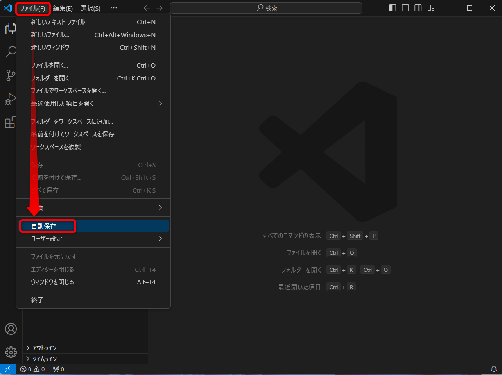
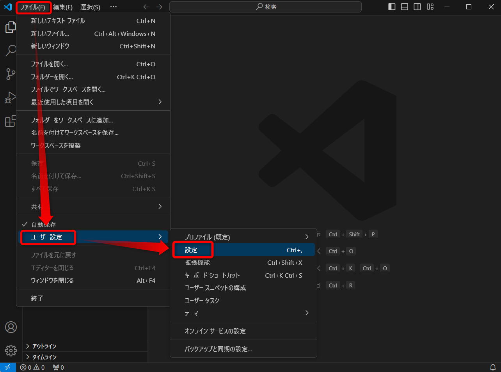
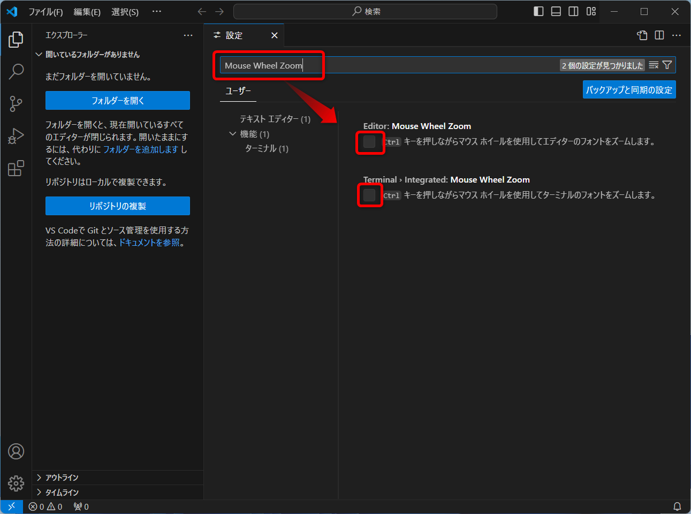
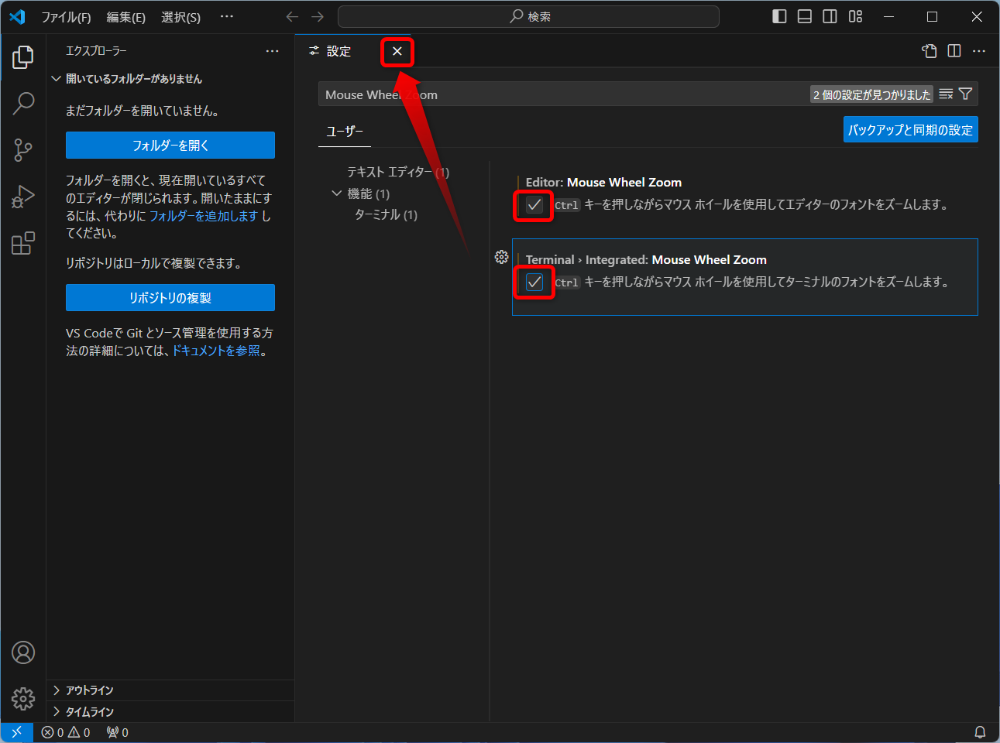

# Visual Studio Code

## インストールの手順

### ダウンロード

下記リンク先からVisual Studio Codeをダウンロードする  
https://code.visualstudio.com/download

`ダウンロード`フォルダに保存する  

### インストール

ダウンロードしたファイルを実行  

`同意する`にチェックを入れて`次へ`をクリック    

`次へ`をクリック  

`次へ`をクリック  

下記にチェックを入れて`次へ`をクリック  
 - `デスクトップ上にアイコンを作成する`
 - `エクスプローラーのディレクトリコンテキストメニューに[Codeで開く]アクションを追加する`

`インストール`をクリック  

インストールされるので少し待つ  

`完了`をクリック  

## 初期設定

`< Welcome`の`<`の部分をクリック  

`Show welcome page on startup`のチェックを外して、`Welcome`タブの`✕`ボタンをクリックして閉じる    

## 日本語化

`拡張機能`ボタンをクリック  

検索エリアに`japanese`と入力して、  `Japanese Language Pack for Visual Studio Code`の`Install`ボタンをクリックする  

インストール完了後、右下の`Change Language and Restart`をクリックする

日本語化完了  

## 便利設定

### 自動保存を有効化

メニューバーから`ファイル`→`自動保存`をクリック  

自動保存が有効化される  

### フォントの拡大縮小有効化

メニューバーから`ファイル`→`ユーザー設定`→`設定`  

`設定の検索`エリアに`Mouse Wheel Zoom`と入力して、下記項目にチェックを入れる  
 - `Editor: Mouse Wheel Zoom`
 - `Terminal › Integrated: Mouse Wheel Zoom`

設定タブの`✕`ボタンをクリックして閉じる  

## 個人メモ

環境変数

`%APPDATA%` : `C:\Users\【ユーザー名】\AppData\Roaming\`

`%USERPROFILE%` : `C:\Users\【ユーザー名】\`

settings.json
- ユーザー設定用の設定ファイル
- 保存先
  - `%APPDATA%\Code\User\`
  - `~/Library/Application Support/Code/User/`

.code-workspaceファイル
- ワークスペース設定用の設定ファイル
- 保存先
  - ワークスペースとして保存される
  - 中身はsettings.jsonで、先に優先される

keybindings.json
- キーボードショートカットのカスタマイズやオーバーライドを行うファイル。
- 保存先
  - `%APPDATA%\Code\User\`
  - `~/Library/Application Support/Code/User/`

launch.json
- デバッグ設定を管理するファイル。  デバッガの起動設定やデバッグ環境変数の設定などを行います。
- 保存先
  - `%USERPROFILE%\.vscode\`
  - `~/.vscode/`

tasks.json
- ビルド、テストなどのタスク実行設定を管理するファイル。  ターミナルでの実行コマンドやタスクの自動化を設定できます。
- 保存先
  - `%USERPROFILE%\.vscode\`
  - `~/.vscode/`

extensions.json
- インストール済みの拡張機能の一覧とその設定を管理するファイル。
- 保存先
  - `%USERPROFILE%\.vscode\`
  - `~/.vscode/`

snippets.json
- スニペットの定義とカスタマイズを行うファイル。  よく使うコード断片をショートカットとして登録できます。
- 保存先
  - ユーザースニペット: `%USERPROFILE%\.vscode\snippets\{言語ID}.json`
    - `~/.vscode/snippets/{言語ID}.json`
  - ワークスペーススニペット: `{ワークスペースフォルダ}\.vscode\snippets\{言語ID}.json`

これらのJSONファイルは、ユーザーフォルダ(.vscode)やワークスペースフォルダ直下の.vscodeフォルダに保存されます。

プロジェクト単位でカスタマイズしたい設定は、ワークスペースの設定ファイルを編集します。
