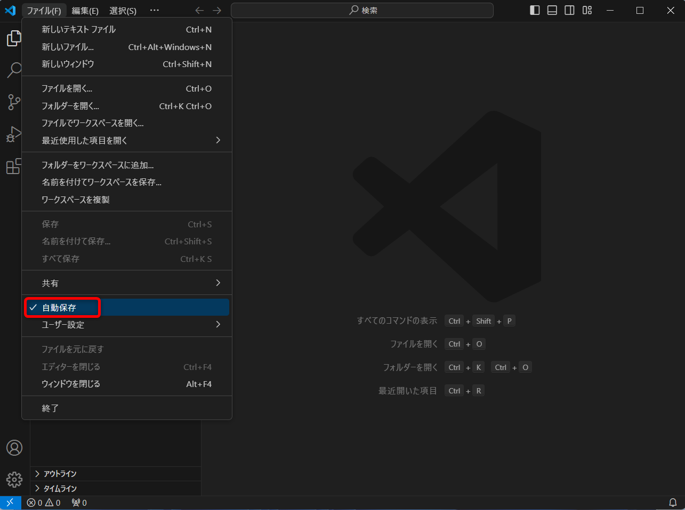

# Visual Studio Code

## インストールの手順

### ダウンロード

下記リンク先からVisual Studio Codeをダウンロードする  
https://code.visualstudio.com/download

`ダウンロード`フォルダに保存する  

### インストール

ダウンロードしたファイルを実行  

`同意する`にチェックを入れて`次へ`をクリック    

`次へ`をクリック  

`次へ`をクリック  

下記にチェックを入れて`次へ`をクリック  
 - `デスクトップ上にアイコンを作成する`
 - `エクスプローラーのディレクトリコンテキストメニューに[Codeで開く]アクションを追加する`

`インストール`をクリック  

インストールされるので少し待つ  

`完了`をクリック  

## 初期設定

`< Welcome`の`<`の部分をクリック  

`Show welcome page on startup`のチェックを外して、`Welcome`タブの`✕`ボタンをクリックして閉じる    

## 日本語化

`拡張機能`ボタンをクリック  

検索エリアに`japanese`と入力して、  `Japanese Language Pack for Visual Studio Code`の`Install`ボタンをクリックする  

インストール完了後、右下の`Change Language and Restart`をクリックする

日本語化完了  

## 便利設定

### 自動保存を有効化

メニューバーから`ファイル`→`自動保存`をクリック  

自動保存が有効化される  

### フォントの拡大縮小有効化

メニューバーから`ファイル`→`ユーザー設定`→`設定`  

`設定の検索`エリアに`Mouse Wheel Zoom`と入力して、  
下記項目にチェックを入れる
 - `Editor: Mouse Wheel Zoom`
 - `Terminal › Integrated: Mouse Wheel Zoom`

設定タブの`✕`ボタンをクリックして閉じる  

